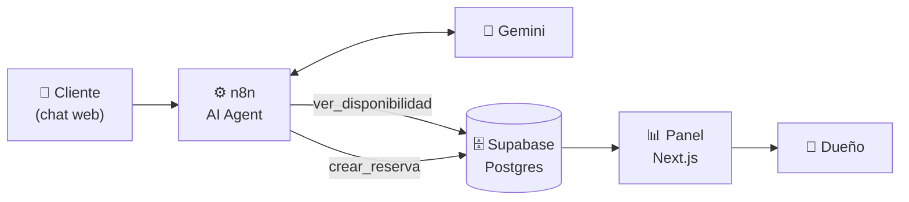

# CoderCup Champions — Turnero de canchas con agente de IA

Un complejo de canchas de fútbol atendido por un agente de IA. El cliente pide
un turno por chat, el agente consulta la disponibilidad **real** en la base,
reserva, y el dueño lo ve aparecer en su panel sin tocar nada.

**Probalo ahora:** [codercup-turnero-canchas.vercel.app](https://codercup-turnero-canchas.vercel.app/)

El botón de chat está abajo a la derecha. Pedile un turno y mirá la grilla
cambiar en la misma pantalla.

---

## Qué hace



Una conversación real, tomada de la instancia en producción:

> **Cliente:** hola, tenés cancha el lunes a las 21?
>
> **Agente:** El lunes 24/08 a las 21:00 no hay cancha de **futbol 5**
> disponible, pero sí de **futbol 7**:
> — **Cancha 3** (futbol 7) a las 21:00 → $35.000 la hora.
> ¿La reservás a nombre de quién?

El agente no está improvisando: llamó a una función de Postgres que le devolvió
las franjas libres de ese día, filtradas por tipo de cancha.

---

## Las decisiones que valen

### La base rechaza la doble reserva, no el prompt

```sql
constraint sin_solapamiento exclude using gist (
  cancha_id with =,
  tstzrange(inicio, fin) with &&
) where (estado = 'confirmada')
```

Si dos personas piden el mismo turno al mismo tiempo, Postgres rechaza la
segunda. **No depende de que la IA se porte bien.** El agente recibe el error y
ofrece otro horario.

Un sistema que confía en que el modelo no se equivoque no es un sistema.

### El agente no puede inventar disponibilidad

No tiene los horarios en el prompt: tiene una herramienta. Cada vez que
alguien pregunta por un día, consulta la base. El system message se lo prohíbe
explícitamente, y como los datos no están en su contexto, tampoco tiene de dónde
sacarlos.

### La grilla razona por solapamiento

Un turno de 20:30 a 21:30 bloquea las franjas de 20:00 **y** de 21:00. La
primera versión comparaba la hora exacta contra las columnas y ese turno
desaparecía de la vista — estando en la base y contado en los totales.

### La credencial no sale del servidor

El panel lee Supabase con la `service_role`, que saltea Row Level Security. Las
variables **no** llevan el prefijo `NEXT_PUBLIC_`, así que Next se niega a
mandarlas al navegador: si alguien intentara usarlas en un componente cliente,
el build falla en vez de filtrar la clave en silencio.

Los teléfonos de los clientes se muestran enmascarados (`•••• 0000`) porque el
panel es público. Verificado que el número real no aparece en el payload de
producción.

### Casi no hay JavaScript de cliente

Todo se renderiza en el servidor. La fecha vive en la URL (`/?fecha=2026-08-23`),
así que el botón "atrás" funciona solo y la página se puede compartir. El único
código de cliente es el que refresca el panel cada 10 segundos — y ni siquiera
toca Supabase: le pide a Next que vuelva a renderizar.

---

## Stack

Todo con capa gratuita.

| Pieza | Herramienta | Por qué |
|---|---|---|
| Automatización | **n8n Cloud** | Los nodos se armaron a mano, no importando un JSON |
| IA | **Google Gemini Flash** | API key gratis, nodo nativo en n8n |
| Base de datos | **Supabase** (Postgres) | RLS activo, exclusion constraints, funciones SQL |
| Canal | **Chat web** (n8n Chat Trigger) | URL pública, cualquiera puede probarlo |
| Panel | **Next.js 16** + Vercel | Server components, CSS propio, sin librerías de UI |

### Por qué chat y no WhatsApp

Porque **ninguna vía gratuita de WhatsApp deja que un desconocido le escriba al
bot**, y eso rompía el objetivo de que el jurado pudiera probarlo:

| Opción | Limitación |
|---|---|
| Meta Cloud API | Hasta 5 números cargados a mano |
| Twilio Sandbox (trial) | Un destinatario activo por vez |
| **Chat Trigger** | **Ninguna: URL pública** |

Abrirlo al público requiere verificar la empresa en Meta y un plan pago. El
canal es lo único atado a esta versión: **el agente, las herramientas y la base
no cambian** si se migra a WhatsApp. Es reemplazar el trigger y agregar un nodo
de envío.

---

## Estructura

```
01-canchas-whatsapp/
├── db/        Esquema, migraciones y consultas de Postgres
├── docs/      Guías paso a paso para rearmar todo desde cero
├── n8n/       Backup del workflow exportado
└── panel/     El panel en Next.js
```

Las guías de [`docs/`](01-canchas-whatsapp/docs/) están escritas para armar los
nodos de n8n **a mano**, campo por campo. No son un JSON para importar: la idea
era aprender la herramienta, no copiarla.

Incluyen los errores reales que aparecieron en el camino y cómo se
diagnosticaron — desde una expresión que quedó en modo *Fixed* y le mandaba al
modelo el texto literal `{{ $json.chatInput }}`, hasta parámetros de
herramienta llamados `parameters0_Value` que el agente completaba a ciegas.

## Correrlo

```bash
cd 01-canchas-whatsapp/panel
cp .env.local.example .env.local   # completar con tus datos de Supabase
npm install
npm run dev
```

El esquema de la base está en [`db/schema.sql`](01-canchas-whatsapp/db/schema.sql).
El detalle de cada paso, en [`docs/`](01-canchas-whatsapp/docs/).

---

## Límites conocidos

Vale más decirlos que esperar a que los encuentren:

- **El panel no tiene login.** Es de solo lectura y los teléfonos van
  enmascarados, pero en producción iría detrás de autenticación.
- **La cuenta de n8n es de prueba**: 50 ejecuciones. Cada mensaje del chat
  consume una.
- **Gemini tiene límite por minuto** en su capa gratuita. Varias personas
  escribiendo a la vez pueden hacerlo fallar.
- **No se pueden cancelar ni reprogramar turnos** desde el chat.
- **Un solo complejo.** No hay multi-tenancy.

## Próximos pasos

- Cancelación y reprogramación desde el chat
- Recordatorio automático el día anterior
- WhatsApp con número verificado
- Login en el panel y varios complejos
- Seña por Mercado Pago al confirmar

---

*Proyecto para CoderCup 2026.*
